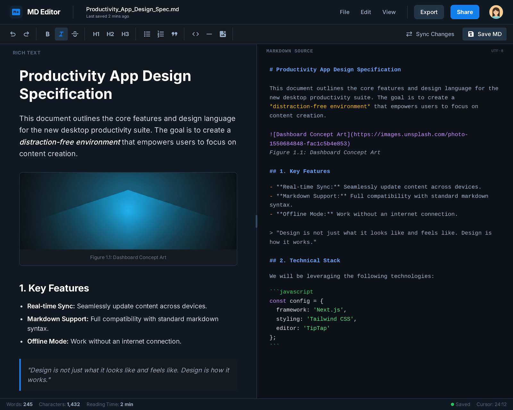

# 📝 Next.js + TipTap Markdown Rich Editor


> **Next.js 16 (App Router)**와 **TipTap 3**를 결합하여 만든 강력하고 세련된 Markdown 에디터입니다. 리치 텍스트 편집과 Markdown 소스 코드의 **실시간 양방향 동기화**를 지원합니다.



## ✨ 핵심 기능 (Key Features)

- **🔄 실시간 동기화 (Real-time Sync):** TipTap 리치 텍스트 에디터와 Markdown 소스 코드 영역 간의 실시간 동기화를 지원합니다.
- **🖼️ 지능형 이미지 처리:** 
  - 로컬 파일 시스템 업로드 지원 (`public/uploads`)
  - 드래그 앤 드롭 (Drag & Drop) 및 복사-붙여넣기 (Paste) 지원.
  - 외부 URL 및 Data URL 붙여넣기 시 자동 서버 업로드 처리.
- **💻 강력한 코드 블록:** `lowlight`를 이용한 Javascript, TypeScript, JSON, Bash, HTML 등 주요 언어의 Syntax Highlighting 지원.
- **📥 파일 내보내기:** 작성된 콘텐츠를 `.md` 파일로 서버 사이드 다운로드 방식으로 저장할 수 있습니다.
- **🌓 테마 지원:** 사용자 설정에 따른 Light/Dark 모드 전환을 완벽하게 지원합니다.

## 🚀 기술 스택 (Tech Stack)

- **Framework:** [Next.js 16 (App Router)](https://nextjs.org/)
- **Editor Core:** [TipTap v3](https://tiptap.dev/)
- **State Management:** React 19 (Hooks)
- **Styling:** Tailwind CSS 4, `@tailwindcss/typography`
- **Utility:** `lowlight`, `file-saver`, `tiptap-markdown`, `lucide-react`

## 🛠️ 시작하기 (Getting Started)

### 사전 준비 (Prerequisites)
- [Node.js](https://nodejs.org/) v18 이상

### 설치 및 실행 (Installation)

```bash
# 의존성 설치
npm install

# 개발 서버 실행
npm run dev
```

브라우저에서 [http://localhost:3000](http://localhost:3000)을 열어 에디터를 확인하세요.

## 📂 프로젝트 구조 (Project Structure)

```text
/
├── src/app/             # Next.js App Router (Page & API)
├── src/components/      # 에디터 및 UI 공용 컴포넌트
├── src/lib/             # 유틸리티 및 훅 (utils, hooks)
├── public/uploads/      # 업로드된 이미지 저장소
├── docs/                # 상세 기술 및 기획 문서
└── LICENSE              # MIT 라이선스
```

## 📜 라이선스 (License)

본 프로젝트는 [MIT License](./LICENSE) 하에 배포됩니다.

## 📖 상세 문서 (Documentation)

더 자세한 정보는 `docs` 폴더 내의 문서들을 참고하세요:
- [GRD.md](./docs/GRD.md) - 기능 요구사항
- [TRD.md](./docs/TRD.md) - 기술 설계 및 아키텍처
- [GUI.md](./docs/GUI.md) - 화면 명세
- [SEQ_DIAGRAM.md](./docs/SEQ_DIAGRAM.md) - 주요 기능 시퀀스 다이어그램

---

Developed with ❤️ using Next.js & TipTap.
